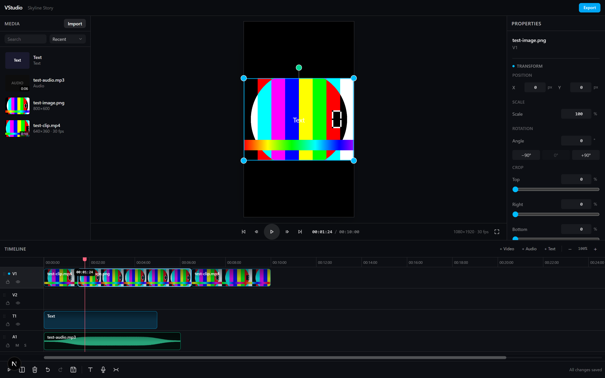
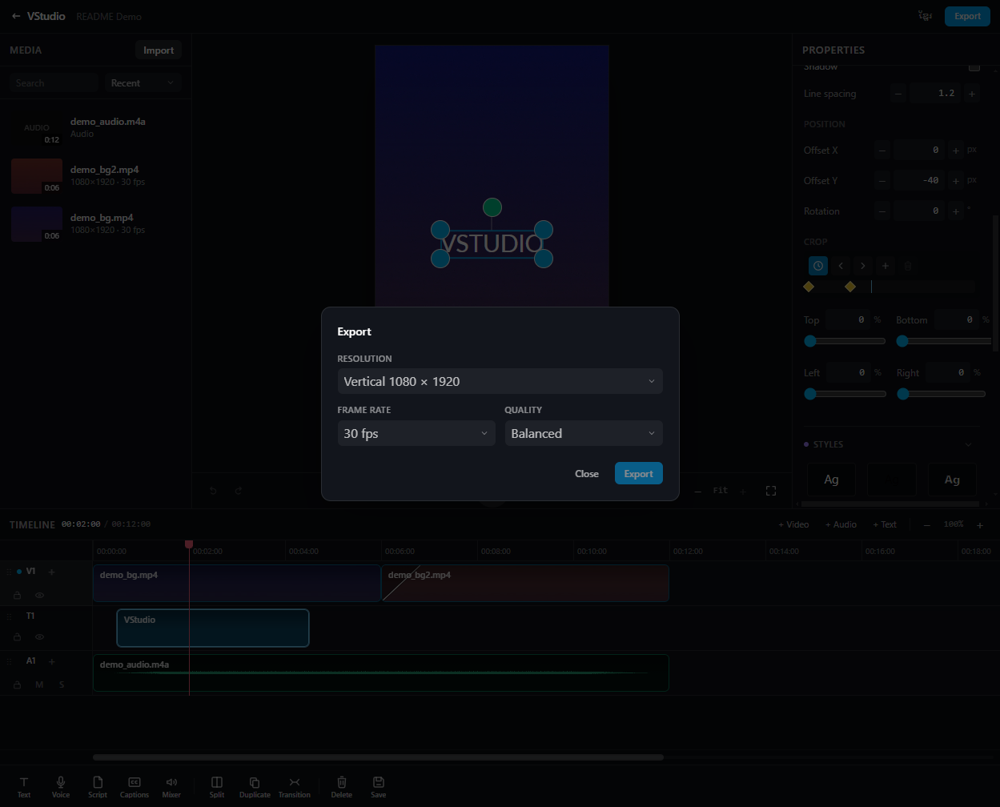
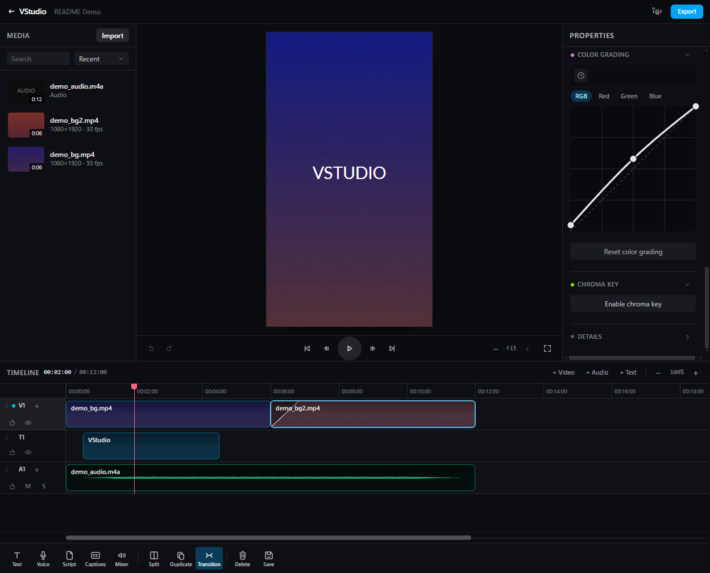
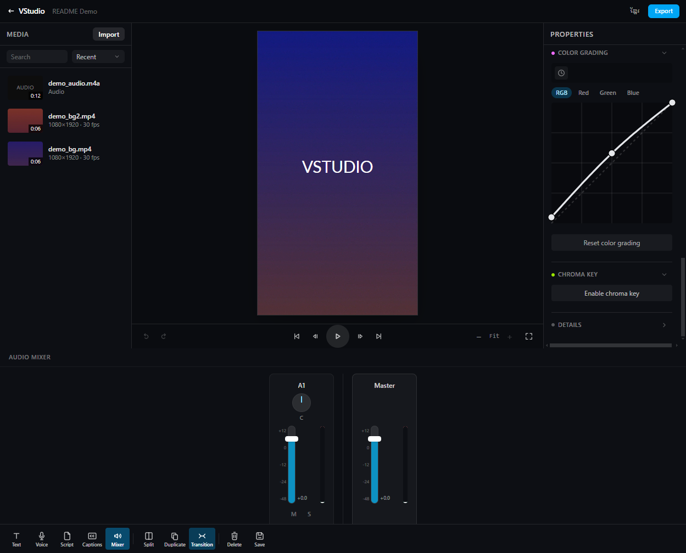

# VCut

> Create faster. Think deeper. Tell better stories.

A fast, focused video editor for short-form creative work — built for a solo creator making 30–60
second educational and cinematic videos, not as a replacement for Premiere or Resolve.

VCut is both a real **standalone studio** in Veasna OS (its own desktop icon, its own home page
at [studios/vcut](../../studios/vcut), its own port) and the **Create** stage of
[BP Studio](../../studios/bp): a BP project goes Idea → Script → **Create** → Publish, and BP embeds
VCut via `<iframe>` for that last-but-one stage rather than owning the editor itself. Same editor,
same projects, two doors in.

<p align="center">
  
  
</p>
<p align="center">
  
  
</p>

---

## What works today

This is the spec's "First Milestone" — the smallest set of operations that make an editor real.
Every one of these is implemented and verified end-to-end against a running app:

1. Launch VCut from a BP project
2. Create a project (created automatically on first open)
3. Import a video
4. See it in the media library with real duration / resolution / frame rate / audio info
5. Add it to the timeline
6. Play it, with audio
7. Scrub it
8. Split it
9. Trim it
10. Move the resulting clips
11. Undo and redo every edit
12. Save the project
13. Close VCut
14. Reopen and see the identical timeline
15. Export the edit to an MP4 that matches it

Plus: drag-and-drop import, snapping, zoom, multi-track (video + audio), dragging clips between
tracks, track lock / hide / mute / solo, autosave, export progress, and export cancellation.

**Position, scale, rotation, and crop.** Every video/image clip can be repositioned, resized, rotated
to any degree (not just 90° steps), and cropped — either by typing exact numbers into the Inspector, or
by dragging directly on the preview (drag the body to move, a corner handle to scale, the handle above
it to rotate). Both controls, and the exported file, are driven by the identical pipeline (crop → fit →
scale → rotate → position), so what you see while dragging is exactly what renders.

**Track rules.** Video and images go on video tracks; audio-only media goes on audio tracks. Dropping
media on the wrong kind of track is refused with an explanation rather than silently accepted — a clip
on a track that can't render it would just never appear. Video tracks are always grouped above audio
tracks, so "drag one track down" never lands somewhere it isn't allowed.

**Effects.** Every video/image clip can have Brightness, Contrast, Saturation, Blur, and Opacity
applied, numerically in the Inspector — the same "one pipeline, computed once, agreeing everywhere"
approach Transform uses, extended with a matching stage in both the canvas preview and the FFmpeg
export graph.

**Color grading.** Per-clip RGB curves — an all-channels curve plus independent Red/Green/Blue
curves, edited by dragging control points on a real curve editor — for lifts, contrast shaping, and
color casts that a single brightness/contrast/saturation slider can't express. A "Chroma key" toggle
on the same panel keys out a color (green-screen style). Rendered identically in preview and export.

**Text.** Text clips (add, edit content, style — font, color, stroke, shadow, line-height, position/
rotation/crop) are a real track kind, rendered in preview and export alike. Text also supports a
**word-highlight** animation (each word emphasized in turn as playback reaches it) and a **crop**
control for revealing/wiping text into view, independent of Position/Scale.

**Keyframes.** Transform, Effects, Color Grading, Text Style, and Text Crop are each keyframeable — a
stopwatch toggle in their own Inspector section, linear interpolation between however many points you
set (Color Grading holds its curve shape at each keyframe rather than interpolating pointwise, since
curves of different shapes have no natural in-between). Export renders every keyframe track via
segment-slicing, so scale/crop/curves/position all animate correctly, not just fade.

**Transitions.** A clip can transition in from whatever clip immediately precedes it on the same
track — crossfade, wipe, slide, or a circular reveal, picked and timed in the Inspector's "Transition
In" section. Clips never overlap in storage; the blend is purely a render-time synthesis, kept in sync
between the canvas preview and the FFmpeg export graph (`xfade`/`acrossfade`) the same way Transform
and Effects are.

**Audio Mixer.** A dedicated Mixer panel with a fader per audio-bearing track plus a Master fader,
for balancing voiceover against music/ambience without hunting through per-clip gain fields.

**Multi-layer video compositing.** Every visible video track composites, in track order — later
tracks drawn on top of earlier ones — in both the canvas preview and the exported file. A clip's own
Transform (position/scale/rotation/crop), Effects (including Opacity), and Transitions all keep
working exactly as on a single track; opacity below 1 genuinely blends against whatever's on the
track(s) beneath it, not against black. Reorder tracks by dragging them in the timeline to change
the stacking order.

**Waveforms.** Every audio clip shows a real waveform (peaks over the source's full duration, one PNG
generated at import), cropped and positioned to match that clip's own trim — dragging a trim handle
crops the waveform live, in step with the drag, rather than only updating once you release.

**Audio gain.** Each clip has its own volume (0–100%), set in the Inspector, applied identically in
preview playback and in the exported file.

**Live voiceover recording.** Record straight from the microphone — a growing "Recording…" indicator
appears in the timeline the instant you start (an empty audio track, or one that already has a prior
take, picked automatically), so there's nothing to wait for and nowhere else to look while you talk.
The finished take lands as a real clip in that exact spot the moment recording stops, and it's kept
out of the Media Library (it's meant to live on the timeline, not clutter the library with one-off
takes).

**Export in/out range.** Export just a portion of the timeline instead of always the whole edit —
set in/out points with `I`/`O` at the playhead or by dragging markers directly on the timeline ruler,
with everything outside the range visibly dimmed. The Export dialog shows the resolved range and a
one-click reset back to the full timeline.

**Fullscreen preview**, and the **playhead automatically follows** playback once it scrolls past the
right edge of the visible timeline.

**Runs natively on mobile**, too — VCut ships inside the Capacitor-wrapped mobile app
([apps/mobile](../../apps/mobile)) with its own on-device FFmpeg plugin (iOS and Android), so import,
preview, and export all work without a server round-trip.

## What is deliberately NOT here yet

Stated plainly, because a polished UI hiding missing features is worse than an honest gap:

- **Caption import/export** — no SRT/VTT import or export. Auto-transcription IS implemented (the
  toolbar's Captions button, Whisper-based) and lands real, editable text clips; SRT/VTT specifically
  is the gap.
- **Per-field keyframe tracks** — keyframing animates a whole property group at once (all of Transform,
  or all of Text Crop, etc.), not independent tracks per individual field.
- **On-canvas crop handles** — crop (both the video/image Transform crop and the text Crop) is
  numeric-only in the Inspector; only Position/Scale/Rotation have draggable handles in the preview.
- **Blend modes** — a video track's own clip opacity is the only cross-track compositing control;
  there's no multiply/screen/etc. blend mode selector.
- **Proxy media** — 4K/8K sources are edited directly. There is no proxy generation step.
- **AI features beyond captions/object removal** — no scene detection or smart reframing.
- **Native file picking** — imported files are *copied* into the project folder (see below).

## Supported formats

| Kind  | Extensions |
|-------|------------|
| Video | `.mp4` `.mov` `.webm` `.mkv` `.avi` `.m4v` |
| Audio | `.wav` `.mp3` `.aac` `.flac` `.m4a` `.ogg` |
| Image | `.png` `.jpg` `.jpeg` `.webp` `.gif` |

Export is H.264 / AAC in an MP4, at 1080×1920, 1920×1080, or 1080×1080, and 24/25/30/50/60 fps.

Stills have no intrinsic length, so they're placed at a default 5 seconds and can be trimmed like any
other clip. They render in the preview and export correctly (FFmpeg `-loop 1`).

## Requirements

- Node 22+
- FFmpeg and ffprobe — installed automatically as `ffmpeg-static` / `ffprobe-static`, no system
  install needed. If a package manager's build policy blocks install scripts, the binary won't
  download; VCut detects this and tells you to run `pnpm rebuild ffmpeg-static` rather than
  failing mysteriously at export time.

## Running it

Standalone (its own home page — create/open a project directly, no BP involved):

```bash
pnpm install
pnpm dev:vcut                 # VCut on :3002
```

Then open `http://localhost:3002`.

Or from inside BP Studio, which embeds VCut via `<iframe>` for its **Create** stage — both need
to be running:

```bash
pnpm dev:bp                      # BP Studio on :3001
pnpm dev:vcut                 # VCut on :3002
```

Then open a project and choose **Create**, or go straight to
`http://localhost:3001/projects/<projectId>/create`.

## Tests

```bash
pnpm --filter @veasnawt/vcut test
```

Runs Node's built-in test runner directly against the TypeScript source — no build step, no test
framework. Covers timeline operations, undo/redo round-trips, project serialization, and FFmpeg
argument generation.

## Where your files live

Projects are stored under the workspace root (`Documents/Veasna OS` in the packaged desktop app, the
repo root in development):

```
.vcut/<bpProjectId>/
  project.json      the edit — clips, tracks, settings
  media/            imported media (copies; originals are never touched)
  thumbnails/       generated library thumbnails
  exports/          rendered videos
```

**Importing copies the file** into `media/`. That costs disk space, and it's a deliberate trade: it
guarantees the original can never be modified, gives FFmpeg a stable path that survives the user
moving their Downloads folder, and works identically in a browser tab (where the web File API hides
real paths) and in the packaged desktop app.

**Editing is non-destructive.** A clip is a reference to a range of a source file. Trimming a
10-minute source to 15 seconds changes two numbers in `project.json` and never rewrites a byte of
media. This is covered by an end-to-end test that hashes the source file before and after a trim.

## More

- [ARCHITECTURE.md](./ARCHITECTURE.md) — how the pieces fit together and why
- [DEVELOPMENT.md](./DEVELOPMENT.md) — working on VCut
